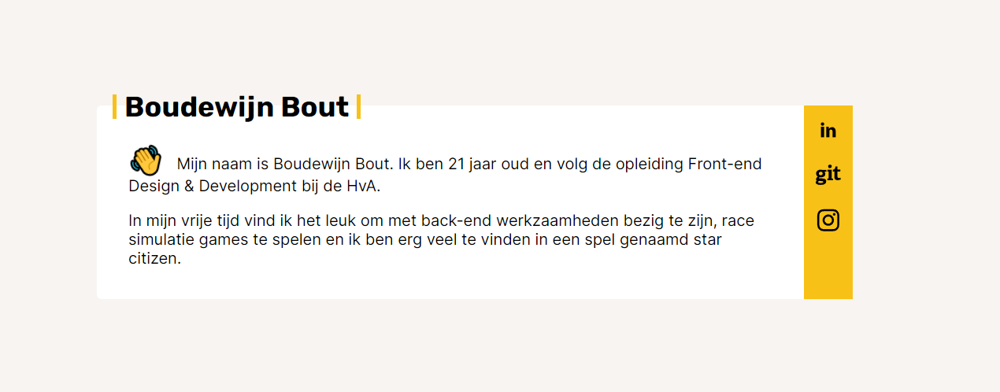

# Persoonlijk visitekaartje met API

Dit project omvat een nieuw persoonlijk visitekaartje, waarbij de data afkomstig is van een API.

## 📚 Inhoudsopgave

* [Beschrijving](#beschrijving)
* [Kenmerken](#kenmerken)
* [Installatie](#installatie)
* [Gebruik](#gebruik)
* [Bronnen](#bronnen)
* [Licentie](#licentie)

## ⚡ Kenmerken
Dit project is gemaakt met HTML, CSS en JavaScript. Verder staat hieronder een korte lijst met gebruikte tools en middelen.

**Tools**

- 🖥️ Webstorm
- ✍ Pen & Papier

**Gebruikte technieken**

- 📟 HTML
- ⌚ CSS
- 📲 JavaScript

## 📥 Installatie

1. Clone of download deze respository.
2. Ga naar de root directory van het project.
3. Open het `index.html` bestand, hierdoor wordt het visitekaartje in de browser geopend.

## 🔨 Gebruik

Dit project bestaat uit één enkele pagina waarop een visitekaartje wordt getoond. 

## 🔗 Handige links

[Wiki](https://github.com/boudewijnbout/connect-your-tribe-fdnd-visitekaartje/wiki)

## 📖 Bronnen
[HTML5](https://www.w3schools.com/html/)
 
[CSS3](https://www.w3schools.com/css/)
 
[JavaScript](https://www.w3schools.com/js/)

## 🔓 Licentie

This work is licensed under [GNU GPLv3](./LICENSE).
